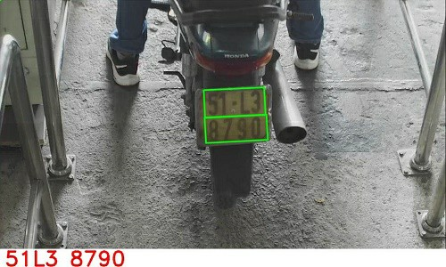
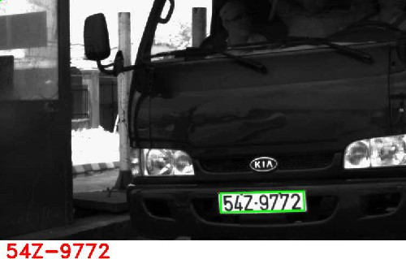
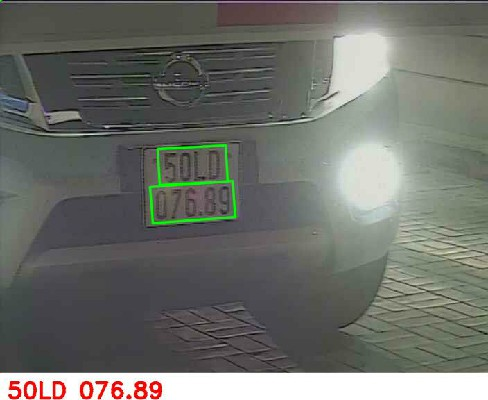
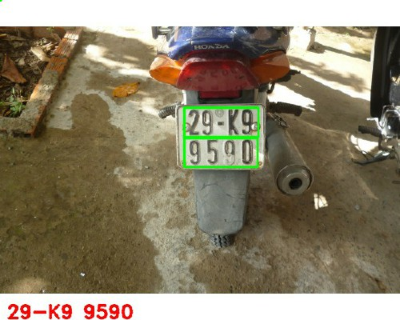
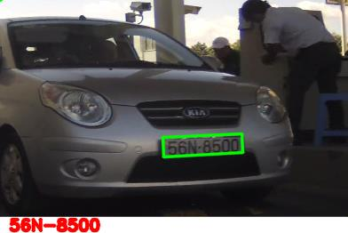

# IPSS v4 - module đọc biển số xe máy & xe hơi

## Tính năng
- Đọc biển số xe máy 4 số và 5 số
- Đọc biển số xe hơi vuông và dài (long & short)
- Đọc được biển số theo Thông tư 58 Bộ Công An
- Đọc được biển số từ camera hồng ngoại
- Đọc được một số biển số khó (nhòe, mờ,... ở mức độ chấp nhận được)

## Demo chức năng
Để test độ chính xác của phần mềm quý khách có thể chạy chương trình build sẵn (.exe) tại đường dẫn:
https://viscomsolution.com/download/IPSS.zip

Quý khách cần cài đặt thư viện để chạy chương trình:
- Microsoft .NET Framework 4.6.1: https://dotnet.microsoft.com/en-us/download/dotnet-framework/net461
- C++ Redistributable 2017 x64:   https://aka.ms/vs/17/release/vc_redist.x64.exe

## Build source code example

Để hiểu cách tích hợp module vào phần mềm cổng kiểm soát bãi xe chúng tôi có kèm theo source code example cách gọi hàm.

Thông tin về source code example:
- Viết bằng ngôn ngữ C#
- Chỉ có 1 phiên bản x64
- Build bằng Visual Studio 2017 trở lên
- Chỉ chạy trên Windows 10 x64
- Kết quả trả về bao gồm: ký tự biển số, mã lỗi (nếu có)
	
	
## Thông tin liên hệ
	
Võ Hùng Vĩ
Phone/zalo: 0939.825.125